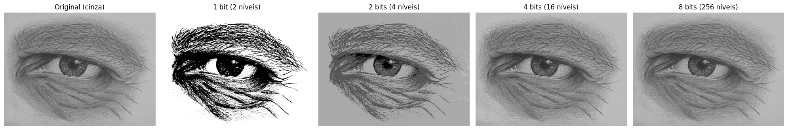

# Processamento de Imagens

Repositório para armazenar as atividades desenvolvidas ao longo da disciplina de Processamento de Imagem.

## Atividades

### [Atividade 1 — Quantização de Imagem](atividade/atividade-1/README.md)

Exercício sobre quantização de imagens em tons de cinza, reduzindo o número de bits (1, 2, 4 e 8 bits) e analisando o impacto na quantidade de detalhes e na suavidade das transições de intensidade, incluindo os efeitos de **posterização** e **banding**.

> Notebook: [`atividade-1-quantizacao.ipynb`](atividade/atividade-1/atividade-1-quantizacao.ipynb)

**Tecnologias utilizadas**

- Python
- NumPy
- Matplotlib
- Pillow (PIL)
- Google Colab

### [Atividade 2 — Histograma de Imagem](atividade/atividade-2/README.md)

Exercício sobre construção e interpretação do histograma de intensidade de uma imagem em tons de cinza, contando manualmente a quantidade de pixels de cada intensidade (0 a 255) e exibindo o resultado em um gráfico de barras.

<table>
  <tr>
    <td align="left" valign="top" width="50%">
      
Imagem de entrada:

      
    </td>
    <td align="left" valign="top" width="50%">
      
Conversão para tons de cinza:

      
    </td>
  </tr>
</table>

<table>
  <tr>
    <td align="left" valign="top">
      
Histograma de intensidades da imagem em tons de cinza:

      
    </td>
  </tr>
</table>

> Notebook: [`atividade_2.ipynb`](atividade/atividade-2/atividade_2.ipynb)

**Tecnologias utilizadas**

- Python
- NumPy
- Matplotlib
- Seaborn
- Pillow (PIL)
- Google Colab
