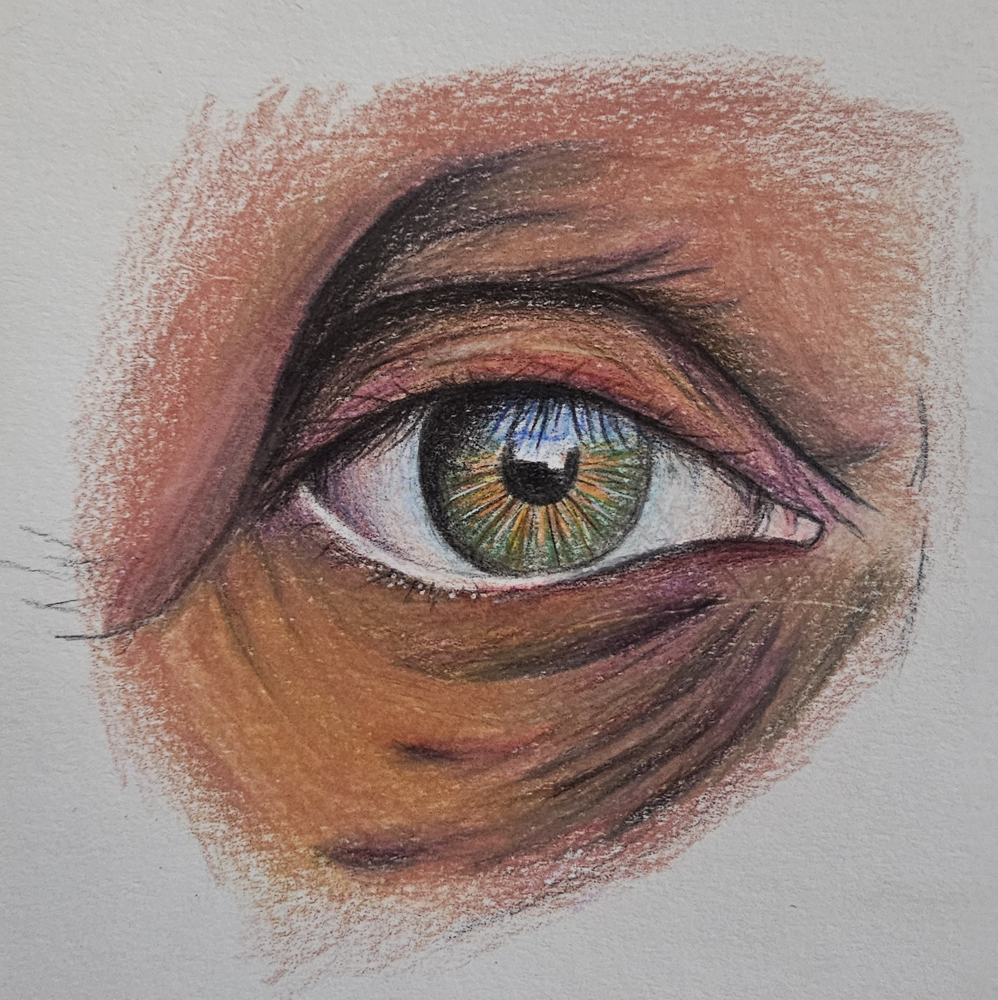
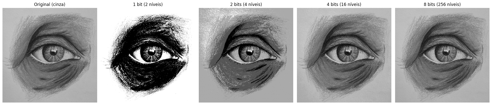

## Exercício: Quantização de Imagem


> Este notebook foi feito para rodar no Google Colab: ele usa `google.colab.files.upload()` para enviar a imagem de entrada.




À medida que reduzimos o número de bits, diminuímos a quantidade de tons de cinza disponíveis:

- 8 bits: 256 níveis — praticamente igual à imagem original, pois ela normalmente já possui 8 bits.
- 4 bits: 16 níveis — ainda preserva muitos detalhes; por isso parece muito semelhante à original e à versão de 8 bits.
- 2 bits: 4 níveis — perde vários detalhes e apresenta regiões com tons mais uniformes, com transições mais bruscas.
- 1 bit: apenas preto e branco — há grande perda de detalhes e nenhuma transição suave de intensidade.

As três imagens — original, 4 bits e 8 bits — parecem parecidas porque 16 níveis de cinza ainda são suficientes para representar visualmente boa parte dos detalhes desse desenho, especialmente por ele já possuir áreas bem definidas e pouco contraste gradual. Porém, observando com atenção, a versão de 4 bits apresenta pequenas faixas ou “degraus” nas regiões sombreadas. Esse efeito é chamado de banding ou posterização.

> Posterização: redução visível da quantidade de tons. A imagem passa a apresentar regiões separadas por níveis bem definidos, como ocorre claramente nas versões de 1 e 2 bits.<br>
> Banding: aparecimento de faixas ou “degraus” em áreas que deveriam ter transições suaves, como um degradê. Pode aparecer na versão de 4 bits, principalmente nas regiões sombreadas.

Em resumo: quanto menos bits, maior a perda de detalhes e mais abruptas ficam as transições entre claro e escuro. Quanto mais bits, mais suaves e naturais são essas transições.

---

### Como a quantização foi implementada

A imagem é inicialmente convertida para tons de cinza de 8 bits, portanto cada pixel pode assumir um valor de intensidade entre 0 e 255, totalizando 256 possíveis tons de cinza.

A quantização reduz essa quantidade de valores. Para isso, o código calcula a quantidade de níveis disponíveis a partir do número de bits:

```
niveis = 2 ** bits
```

Assim:

```
- 8 bits → 256 níveis de intensidade
- 4 bits → 16 níveis de intensidade
- 2 bits → 4 níveis de intensidade
- 1 bit → 2 níveis de intensidade
```

Em seguida, é calculado o tamanho de cada intervalo de intensidade:

```
passo = 256 / niveis
```

Por exemplo, para 2 bits, existem 4 níveis, então os 256 valores possíveis são divididos em 4 intervalos de 64 valores:

```
0–63     → nível 1
64–127   → nível 2
128–191  → nível 3
192–255  → nível 4
```

A linha:

```
q = np.floor(im / passo) * passo
```

faz a quantização propriamente dita. Ela agrupa valores de intensidade que pertencem ao mesmo intervalo, fazendo com que diferentes pixels passem a ser representados por um mesmo valor.

Por exemplo, com 2 bits:

```
40  → 0
70  → 64
100 → 64
150 → 128
220 → 192
```

Dessa forma, valores diferentes da imagem original são substituídos por uma quantidade menor de valores representativos.

Por fim, os valores são reescalados para a faixa de 0 a 255 para facilitar a visualização da imagem quantizada:

```
q = q * (255 / (256 - passo))
```

A implementação utiliza operações matemáticas sobre os valores dos pixels com NumPy, sem utilizar uma função específica de quantização pronta.

### Relação entre bits e qualidade da imagem

Quanto menor o número de bits, menor é a quantidade de níveis de intensidade disponíveis. Consequentemente, mais valores diferentes precisam ser representados pelo mesmo nível, causando perda de informação — o que produz posterização e, nas regiões de transição suave, o efeito de banding, como descrito no início deste documento.

