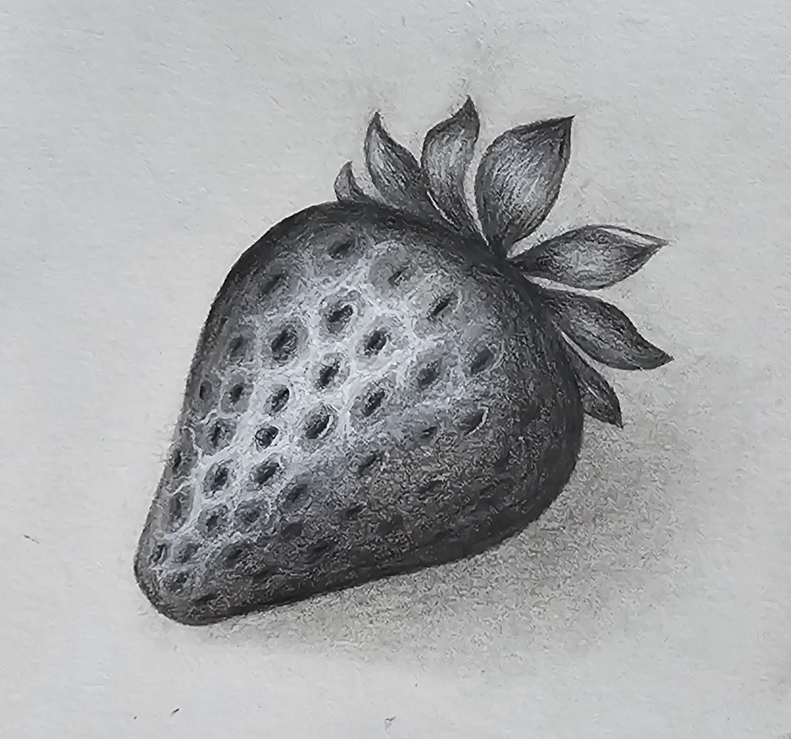
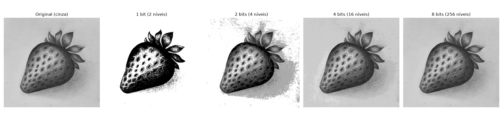

# Atividade 1 — Quantização de Imagem


[](https://colab.research.google.com/github/lianeheidemann/atividades-processamento-de-imagens/blob/main/atividade/atividade-1/atividade-1-quantizacao.ipynb)

[⬅ Voltar para o repositório principal](../../README.md)

### Sobre o exercício

O objetivo é entender o efeito da **quantização de intensidade** em uma imagem em tons de cinza: a imagem original (8 bits, 256 níveis) é reduzida para 4, 2 e 1 bit(s), e o resultado de cada redução é comparado visualmente e explicado.

**Pergunta guia:** o que acontece com os detalhes e com as transições de intensidade da imagem à medida que reduzimos o número de bits?

### Sumário

- [Como executar](#como-executar)
- [Resultado](#resultado)
- [Análise](#análise)
- [Como a quantização foi implementada](#como-a-quantização-foi-implementada)
- [Relação entre bits e qualidade da imagem](#relação-entre-bits-e-qualidade-da-imagem)

### Como executar

O notebook [`atividade-1-quantizacao.ipynb`](atividade-1-quantizacao.ipynb) lê uma imagem local (variável `nome`, por padrão [`input/morango.jpg`](input/morango.jpg)):

1. Abra o notebook (localmente ou no Colab).
2. Ajuste a variável `nome` para o caminho da imagem desejada, se necessário.
3. Execute as células em ordem: a imagem é convertida para tons de cinza e exibida lado a lado com as versões quantizadas em 1, 2, 4 e 8 bit(s).
4. A figura gerada é salva automaticamente em [`output/quantizacao.png`](output/quantizacao.png).

### Resultado

<table>
<tr>
<td align="left" valign="top">

<p>Imagem original utilizada como entrada:</p>



<p>Comparação entre as imagens original e as versões quantizadas em 1, 2, 4 e 8 bit(s):</p>



</td>
</tr>

</table>

### Análise

À medida que reduzimos o número de bits, diminuímos a quantidade de tons de cinza disponíveis:

- **8 bits:** 256 níveis — imagem idêntica à original, com todo o gradiente suave do desenho a lápis preservado, incluindo a textura do papel e o sombreado sutil do morango.
- **4 bits:** 16 níveis — visualmente quase indistinguível da original; o sombreado do morango e o fundo continuam suaves, sem degraus perceptíveis.
- **2 bits:** 4 níveis — o fundo, antes uniforme, passa a exibir um forte ruído "granulado" (speckling), pois os poucos níveis disponíveis não conseguem representar bem a textura sutil do papel. O corpo do morango perde parte do sombreado, ficando com regiões de cinza mais uniformes e bordas mais duras.
- **1 bit:** apenas preto e branco — o morango vira praticamente uma silhueta binária; os pontinhos (sementes) só continuam visíveis porque formam um forte contraste local, mas todo o sombreado desaparece. O fundo, que era quase branco liso, agora mostra manchas pretas espalhadas nas áreas de textura mais escura do papel.

> **Posterização:** redução visível da quantidade de tons. A imagem passa a apresentar regiões separadas por níveis bem definidos, como ocorre claramente nas versões de 1 e 2 bits.
>
> **Banding:** aparecimento de faixas, degraus ou ruído granulado em áreas que deveriam ter transições suaves, como o fundo texturizado do papel. Fica evidente já na versão de 2 bits.

Em resumo: como o desenho original já tem baixo contraste e transições suaves (sombreado a lápis e textura de papel), a perda começa a ficar visível já em 2 bits, principalmente como ruído no fundo, e se torna extrema em 1 bit, onde a imagem se reduz a uma silhueta de alto contraste. Já em 4 e 8 bits o resultado é praticamente igual ao original, pois 16 níveis de cinza já são suficientes para reproduzir esse tipo de sombreado suave.

### Como a quantização foi implementada

A imagem é inicialmente convertida para tons de cinza de 8 bits, portanto cada pixel pode assumir um valor de intensidade entre 0 e 255, totalizando 256 possíveis tons de cinza.

A quantização reduz essa quantidade de valores. Para isso, o código calcula a quantidade de níveis disponíveis a partir do número de bits:

```python
niveis = 2 ** bits
```

Assim:

| Bits | Níveis de intensidade |
| :--: | :--------------------: |
| 8    | 256                     |
| 4    | 16                      |
| 2    | 4                       |
| 1    | 2                       |

Em seguida, é calculado o tamanho de cada intervalo de intensidade:

```python
passo = 256 / niveis
```

A linha:

```python
q = np.floor(im / passo) * passo
```

faz a quantização propriamente dita. Ela agrupa valores de intensidade que pertencem ao mesmo intervalo, fazendo com que diferentes pixels passem a ser representados por um mesmo valor.

Por exemplo, para 2 bits existem 4 níveis, então os 256 valores possíveis são divididos em 4 intervalos de 64 valores:

| Intervalo | Nível | Valor original → quantizado |
| :-------: | :---: | :--------------------------: |
| 0–63      | 1     | 40 → 0                       |
| 64–127    | 2     | 70 → 64, 100 → 64             |
| 128–191   | 3     | 150 → 128                    |
| 192–255   | 4     | 220 → 192                    |

Dessa forma, valores diferentes da imagem original são substituídos por uma quantidade menor de valores representativos.

Por fim, os valores são reescalados para a faixa de 0 a 255 para facilitar a visualização da imagem quantizada:

```python
q = q * (255 / (256 - passo))
```

A implementação utiliza operações matemáticas sobre os valores dos pixels com NumPy, sem utilizar uma função específica de quantização pronta.

### Relação entre bits e qualidade da imagem

Quanto menor o número de bits, menor é a quantidade de níveis de intensidade disponíveis. Consequentemente, mais valores diferentes precisam ser representados pelo mesmo nível, causando perda de informação — o que produz posterização e, nas regiões de transição suave, o efeito de banding, como descrito no início deste documento.
