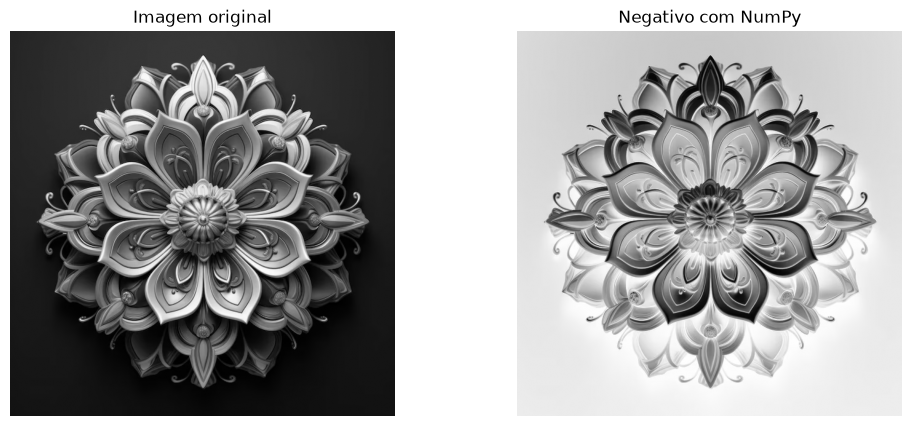
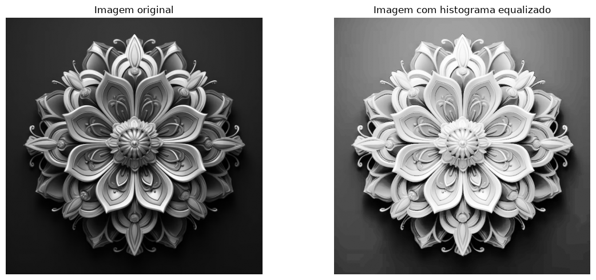
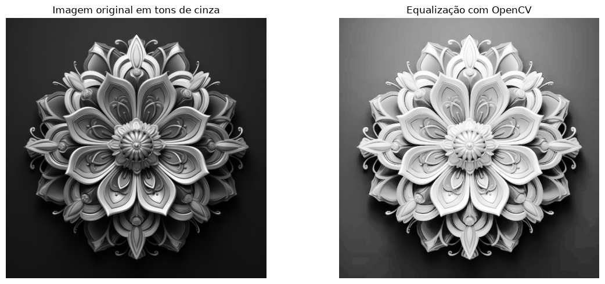
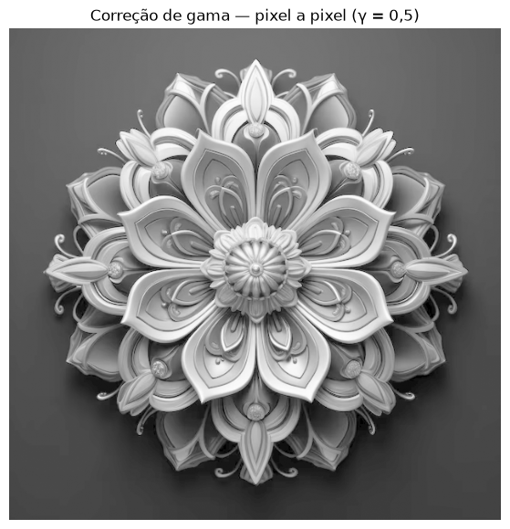

# Atividade 2 — Histograma, Negativo, Equalização e Correção Gamma


[](https://colab.research.google.com/github/lianeheidemann/atividades-processamento-de-imagens/blob/main/atividade/atividade-2/atividade_2.ipynb)

[⬅ Voltar para o repositório principal](../../README.md)

### Sobre o exercício

O objetivo é explorar um conjunto de operações clássicas de processamento de imagens em tons de cinza, aplicadas sobre a mesma imagem de entrada:

- construção e interpretação do **histograma de intensidade**;
- cálculo do **negativo digital**;
- **equalização do histograma**;
- **correção gamma**.

Cada operação é implementada de duas formas: uma versão manual, percorrendo a imagem pixel a pixel, e uma versão vetorizada (com NumPy ou com uma função pronta de biblioteca), para comparar a lógica do processamento com uma implementação mais eficiente.

**Pergunta guia:** o que cada uma dessas transformações revela e altera na distribuição de intensidades e na aparência da imagem?

### Sumário

- [Como executar](#como-executar)
- [1. Histograma](#1-histograma)
- [2. Negativo](#2-negativo)
- [3. Equalização do histograma](#3-equalização-do-histograma)
- [4. Correção gamma](#4-correção-gamma)

### Como executar

O notebook [`atividade_2.ipynb`](atividade_2.ipynb) foi feito para rodar no **Google Colab**:

1. Abra o notebook no Colab.
2. Execute a célula de upload — ela vai pedir o envio de uma imagem através de `google.colab.files.upload()`.
3. Envie uma imagem (por exemplo, a disponível em [`input/`](input)).
4. A imagem é convertida para tons de cinza e, a partir dela, são calculados o histograma, o negativo, a equalização do histograma e a correção gamma.

### 1. Histograma

O histograma de intensidade conta quantos pixels existem para cada valor de intensidade (0 a 255). O notebook mostra três formas de calcular e exibir esse histograma:

- **Método 1 — dois laços:** percorre a matriz linha a linha e pixel a pixel, incrementando manualmente a posição correspondente em um vetor de 256 posições.
- **Método 2 — `ravel()`:** achata a matriz em um vetor unidimensional e percorre os pixels em um único laço.
- **Método 3 — `plt.hist()`:** usa a função pronta do Matplotlib para calcular e desenhar o histograma diretamente.

<table>
  <tr>
    <td align="left" valign="top" width="50%">
      <p>Imagem de entrada:</p>
      
    </td>
    <td align="left" valign="top" width="50%">
      <p>Conversão para tons de cinza:</p>
      
    </td>
  </tr>
</table>

<table>
  <tr>
    <td align="left" valign="top">
      <p>Histograma de intensidades da imagem em tons de cinza (método manual com dois laços):</p>
      
    </td>
  </tr>
</table>

O histograma mostra uma concentração muito grande de pixels nas intensidades mais baixas (entre aproximadamente 0 e 60), o que corresponde ao fundo escuro da imagem. A partir da intensidade 64, a quantidade de pixels cai bastante e passa a diminuir de forma gradual até os tons mais claros, próximos de 255, o que reflete os reflexos e detalhes claros da mandala, que ocupam uma área proporcionalmente menor da imagem.

```python
imagem_cinza = imagem.convert("L")
matriz = np.array(imagem_cinza)

histograma = np.zeros(256, dtype=int)

for linha in matriz:
    for pixel in linha:
        intensidade = int(pixel)
        histograma[intensidade] += 1
```

### 2. Negativo

O negativo digital inverte a intensidade de cada pixel: tons escuros viram claros e vice-versa. É implementado de duas formas:

- **Pixel a pixel:** percorre a imagem com dois laços (`for`) e calcula `255 - pixel` para cada posição.
- **Vetorizado com NumPy:** aplica `255 - imagem` em toda a matriz de uma só vez.

<table>
  <tr>
    <td align="left" valign="top">
      <p>Imagem original e negativo (calculado com NumPy):</p>
      
    </td>
  </tr>
</table>

```python
def negativo_numpy(imagem):
    imagem = np.array(imagem, dtype=np.uint8)
    return 255 - imagem
```

### 3. Equalização do histograma

A equalização redistribui as intensidades da imagem de forma a espalhar melhor os tons ao longo da faixa de 0 a 255, aumentando o contraste. É implementada de duas formas:

- **Manual:** calcula o histograma, a distribuição acumulada (CDF), normaliza a CDF para o intervalo de 0 a 255 e substitui cada pixel pelo novo valor correspondente.
- **Com OpenCV:** usa a função pronta `cv2.equalizeHist()`.

<table>
  <tr>
    <td align="left" valign="top">
      <p>Equalização manual do histograma:</p>
      
    </td>
  </tr>
  <tr>
    <td align="left" valign="top">
      <p>Equalização com <code>cv2.equalizeHist()</code>:</p>
      
    </td>
  </tr>
</table>

Como a imagem original é dominada por tons escuros, a equalização clareia bastante a mandala e realça detalhes que antes estavam concentrados nas sombras, resultado equivalente entre a versão manual e a versão com OpenCV.

```python
cdf = np.cumsum(histograma)
cdf_min = cdf[cdf > 0].min()

cdf_normalizada = 255 * (cdf - cdf_min) / (cdf[-1] - cdf_min)
cdf_normalizada = np.clip(cdf_normalizada, 0, 255)
```

### 4. Correção gamma

A correção gamma aplica uma função de potência sobre a intensidade normalizada de cada pixel (`intensidade_normalizada ** gamma`), permitindo clarear (`gamma < 1`) ou escurecer (`gamma > 1`) a imagem de forma não linear. É implementada de duas formas:

- **Pixel a pixel:** percorre a imagem com dois laços, normaliza cada pixel para o intervalo de 0 a 1, aplica a fórmula e reescala para 0–255.
- **Vetorizado com NumPy:** aplica a mesma fórmula em toda a matriz de uma só vez.

<table>
  <tr>
    <td align="left" valign="top" width="50%">
      <p>Correção gamma — pixel a pixel (γ = 0,5):</p>
      
    </td>
    <td align="left" valign="top" width="50%">
      <p>Correção gamma — NumPy (γ = 0,5):</p>
      
    </td>
  </tr>
</table>

Com γ = 0,5 (menor que 1), a imagem fica mais clara, já que a função de potência aumenta proporcionalmente mais os valores baixos de intensidade do que os altos.

```python
def correcao_gamma_numpy(imagem, gamma):
    imagem = np.array(imagem, dtype=np.uint8)
    imagem_normalizada = imagem / 255.0
    resultado = 255 * (imagem_normalizada ** gamma)
    return resultado.astype(np.uint8)
```

Em todos os casos, as versões manuais (com laços `for`) produzem o mesmo resultado que as versões vetorizadas (NumPy) ou baseadas em funções prontas (Matplotlib, OpenCV), servindo para entender o funcionamento de cada transformação antes de recorrer a implementações otimizadas.
