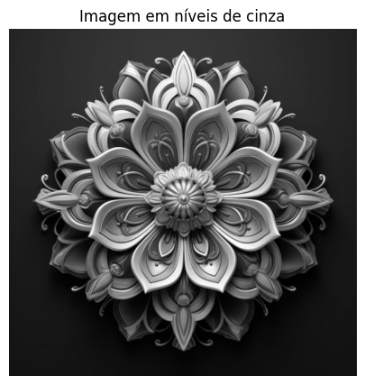
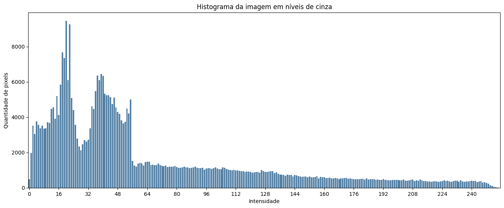

# Atividade 2 — Histograma de Imagem


[](https://colab.research.google.com/github/lianeheidemann/atividades-processamento-de-imagens/blob/main/atividade/atividade-2/atividade_2.ipynb)

[⬅ Voltar para o repositório principal](../../README.md)

### Sobre o exercício

O objetivo é entender como construir e interpretar o **histograma de intensidade** de uma imagem em tons de cinza: cada pixel é contado de acordo com seu valor de intensidade (0 a 255), gerando um vetor com a frequência de cada tom, que em seguida é visualizado em um gráfico de barras.

**Pergunta guia:** o que a distribuição de intensidades revela sobre o contraste e a composição de tons da imagem?

### Sumário

- [Como executar](#como-executar)
- [Resultado](#resultado)
- [Análise](#análise)
- [Como o histograma foi implementado](#como-o-histograma-foi-implementado)

### Como executar

O notebook [`atividade_2.ipynb`](atividade_2.ipynb) foi feito para rodar no **Google Colab**:

1. Abra o notebook no Colab.
2. Execute a célula de código — ela vai pedir o upload de uma imagem através de `google.colab.files.upload()`.
3. Envie uma imagem (por exemplo, a disponível em [`input/`](input)).
4. A imagem é convertida para tons de cinza, transformada em uma matriz e o histograma de intensidades é calculado e exibido em um gráfico de barras.

### Resultado

<table>
  <tr>
    <td align="left" valign="top" width="50%">
      <p>Imagem de entrada:</p>
      
    </td>
    <td align="left" valign="top" width="50%">
      <p>Conversão para tons de cinza:</p>
      
    </td>
  </tr>
</table>

<table>
  <tr>
    <td align="left" valign="top">
      <p>Histograma de intensidades da imagem em tons de cinza:</p>
      
    </td>
  </tr>
</table>

### Análise

O histograma mostra uma concentração muito grande de pixels nas intensidades mais baixas (entre aproximadamente 0 e 60), o que corresponde ao fundo escuro da imagem. Há dois picos bem definidos nessa faixa — um em torno de 16–24 e outro em torno de 36–44 — que representam, respectivamente, as regiões mais escuras do fundo e os tons intermediários presentes nas sombras e contornos da mandala.

A partir da intensidade 64, a quantidade de pixels cai bastante e passa a diminuir de forma gradual até os tons mais claros, próximos de 255. Isso reflete os reflexos e detalhes dourados da mandala, que ocupam uma área proporcionalmente menor da imagem.

Em resumo: o histograma evidencia que a imagem é dominada por tons escuros (fundo) e possui poucos pixels muito claros, o que é típico de imagens com fundo escuro e um objeto de destaque no centro.

### Como o histograma foi implementado

A imagem é convertida para tons de cinza e transformada em uma matriz com NumPy, na qual cada posição representa a intensidade de um pixel (0 a 255):

```python
imagem_cinza = imagem.convert("L")
matriz = np.array(imagem_cinza)
```

Em seguida, é criado um vetor de 256 posições — uma para cada intensidade possível — inicializado com zeros:

```python
histograma = np.zeros(256, dtype=int)
```

O vetor é preenchido percorrendo cada pixel da matriz e incrementando a posição correspondente à sua intensidade:

```python
for linha in matriz:
    for pixel in linha:
        intensidade = int(pixel)
        histograma[intensidade] += 1
```

Por fim, o histograma é exibido em um gráfico de barras com `seaborn.barplot()`, no qual o eixo X representa as intensidades (0 a 255) e o eixo Y representa a quantidade de pixels com aquela intensidade:

```python
sns.barplot(x=intensidades, y=histograma, color="steelblue")
```

A implementação conta manualmente a ocorrência de cada intensidade, percorrendo a matriz pixel a pixel, sem utilizar uma função pronta de histograma como `np.histogram()`.
