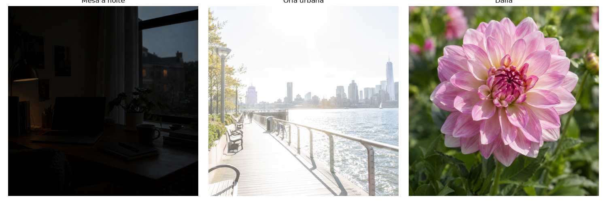
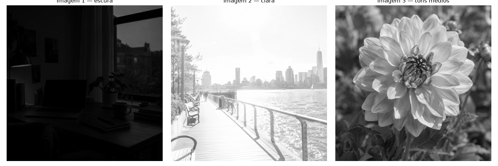
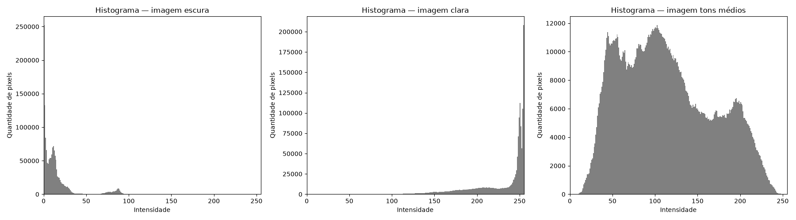
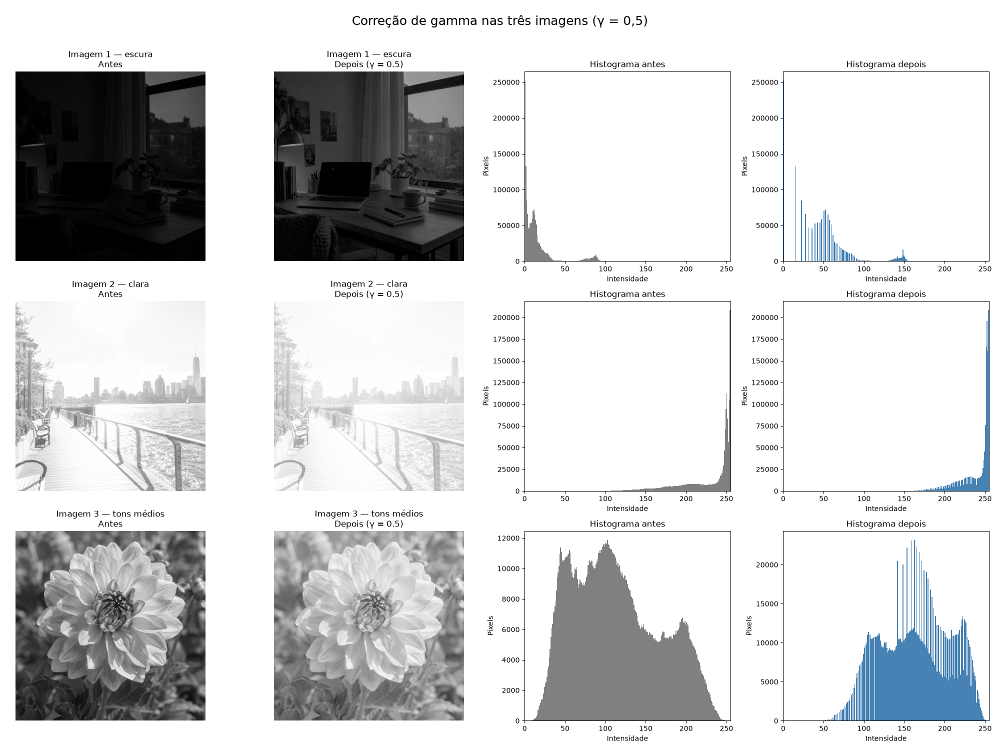

# Atividade 2 — Histograma e Correção Gamma em Múltiplas Imagens


[](https://colab.research.google.com/github/lianeheidemann/atividades-processamento-de-imagens/blob/main/atividade/atividade-2/atividade_2-entregar.ipynb)

[⬅ Voltar para o repositório principal](../../README.md)

> Selecionar três imagens — uma escura, uma clara e uma bem exposta —, convertê-las para tons de cinza e analisar seus histogramas. Depois, aplicar uma técnica de melhoria, comparar o antes e o depois e identificar em qual imagem a operação causou menos diferença.

### 1. Imagens utilizadas

Três imagens com perfis de iluminação diferentes são usadas para comparar o efeito das operações em cenários distintos:

- **Mesa à noite** — imagem escura, mesa de trabalho iluminada apenas pela luminária.
- **Orla urbana** — imagem clara, calçadão à beira-rio com céu estourado ao fundo.
- **Dália** — imagem de tons médios, flor em close com boa distribuição de intensidades.

<table>
  <tr>
    <td align="left" valign="top">
      <p>Imagens originais:</p>
      
    </td>
  </tr>
  <tr>
    <td align="left" valign="top">
      <p>Conversão para tons de cinza:</p>
      
    </td>
  </tr>
</table>

```python
imagem_cinza_1 = imagem_1.convert("L")
imagem_cinza_2 = imagem_2.convert("L")
imagem_cinza_3 = imagem_3.convert("L")
```

### 2. Histograma

O histograma de cada imagem é calculado com a função pronta `plt.hist()`, permitindo comparar rapidamente a distribuição de intensidades das três imagens lado a lado:

```python
plt.hist(
    np.array(imagem_cinza_1).ravel(),
    bins=256,
    range=(0, 256),
    color="gray"
)
```

<table>
  <tr>
    <td align="left" valign="top">
      
    </td>
  </tr>
</table>

- **Imagem 1 (mesa à noite):** as intensidades estão fortemente concentradas entre 0 e 60 (93,5% dos pixels), com média 13,7 e nenhum pixel acima de 108, indicando uma imagem muito escura, sem uso da faixa superior de intensidades.
- **Imagem 2 (orla urbana):** há uma forte concentração acima de 200 (81,5% dos pixels), com média 229,3, indicando predominância de regiões muito claras, principalmente por causa do céu estourado ao fundo.
- **Imagem 3 (dália):** as intensidades estão amplamente distribuídas entre 7 e 255, com média 113,3, indicando uma imagem de tons médios com boa variedade de intensidades.

### 3. Correção gamma

A mesma correção gamma (γ = 0,5) é aplicada de forma vetorizada às três imagens simultaneamente, e o resultado — imagem e histograma, antes e depois — é comparado em uma única figura:

```python
gamma = 0.5

resultado_1 = (255 * ((matriz_1 / 255.0) ** gamma)).astype(np.uint8)
resultado_2 = (255 * ((matriz_2 / 255.0) ** gamma)).astype(np.uint8)
resultado_3 = (255 * ((matriz_3 / 255.0) ** gamma)).astype(np.uint8)
```

<table>
  <tr>
    <td align="left" valign="top">
      
    </td>
  </tr>
</table>

A correção gamma fez menos diferença na Imagem 2 (orla urbana): a diferença média de intensidade entre antes e depois foi de apenas 11,2 níveis, contra 32,5 na Imagem 1 e 51,0 na Imagem 3. Isso acontece porque o histograma original da Imagem 2 já estava fortemente concentrado nas intensidades altas (81,5% dos pixels acima de 200), indicando que ela já era predominantemente clara. Como foi utilizado γ = 0,5, os pixels foram deslocados em direção ao branco, mas as intensidades dessa imagem já estavam próximas do valor máximo de 255; por isso, a alteração visual foi menor do que nas imagens 1 (mesa à noite) e 3 (dália), que tinham mais espaço para clarear.
