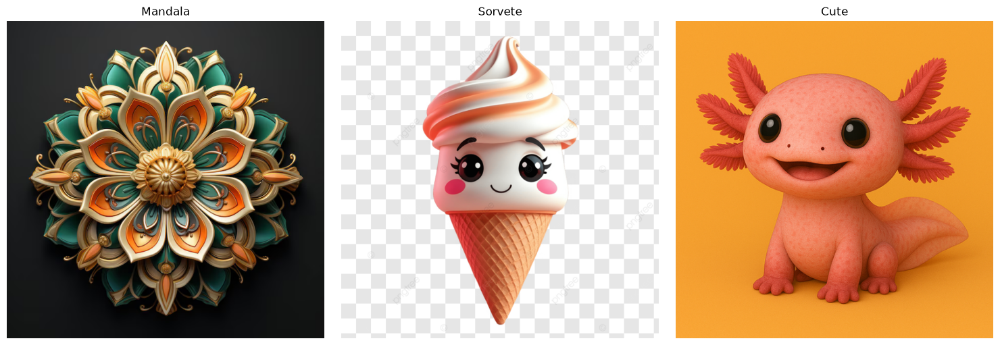
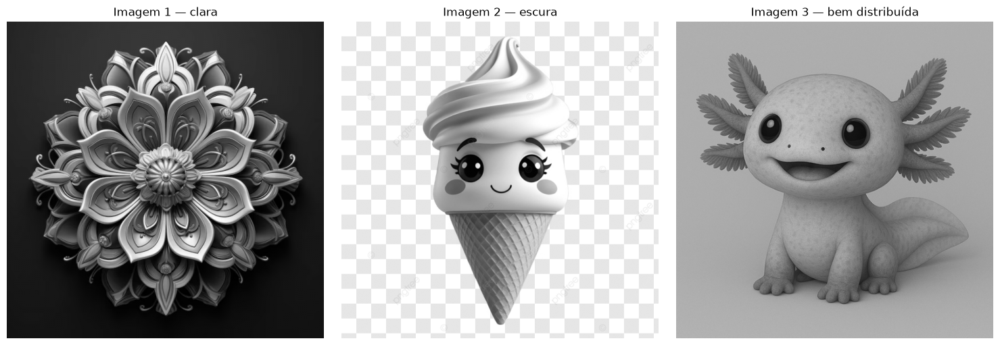
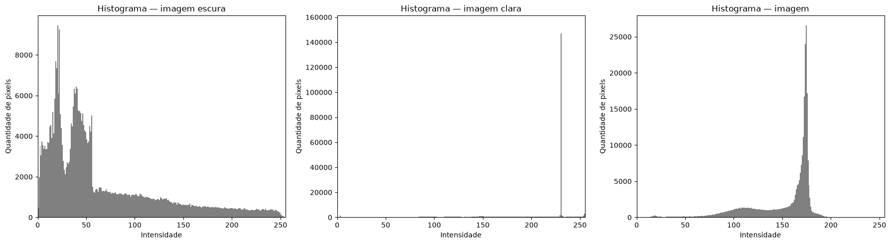
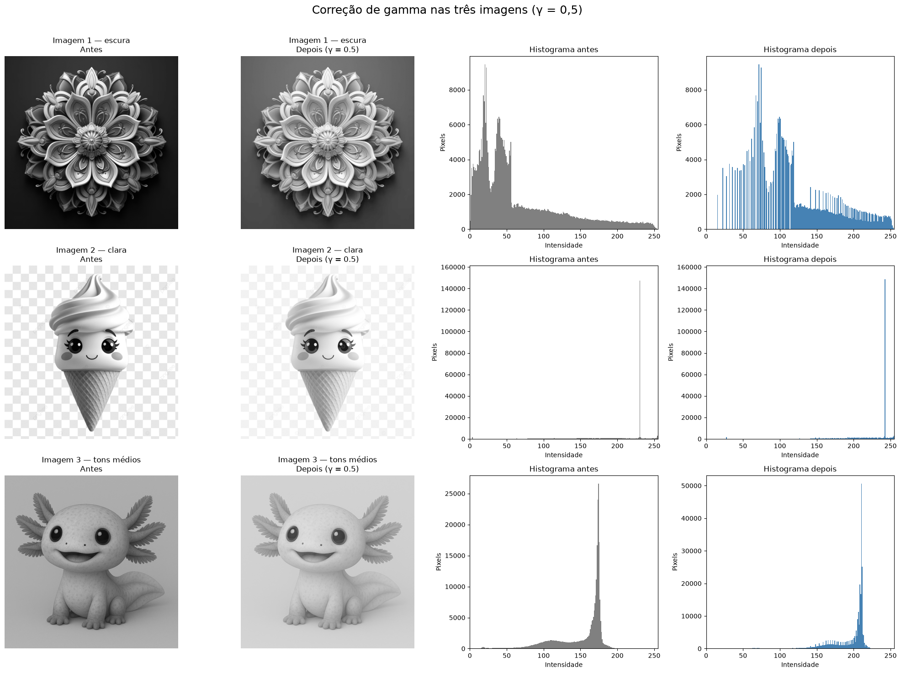

# Atividade 2 (entrega) — Histograma e Correção Gamma em Múltiplas Imagens


[⬅ Voltar para o repositório principal](../../README.md) · [Ver também: versão completa da Atividade 2](README.md)

### Sobre o exercício

Esta é a versão de entrega do notebook [`atividade_2-entregar.ipynb`](atividade_2-entregar.ipynb): uma versão enxuta, sem `google.colab.files.upload()`, que carrega três imagens locais diferentes — uma escura, uma clara e uma de tons médios — e aplica sobre elas duas operações:

- construção e comparação do **histograma de intensidade** das três imagens;
- **correção gamma** (γ = 0,5) aplicada às três imagens ao mesmo tempo.

**Pergunta guia:** como o histograma de uma imagem se relaciona com sua exposição de luz (clara, escura ou balanceada) e como a correção gamma afeta cada um desses casos?

### Sumário

- [Como executar](#como-executar)
- [1. Imagens utilizadas](#1-imagens-utilizadas)
- [2. Histograma](#2-histograma)
- [3. Correção gamma](#3-correção-gamma)

### Como executar

O notebook [`atividade_2-entregar.ipynb`](atividade_2-entregar.ipynb) foi adaptado para rodar localmente (fora do Colab):

1. Coloque as três imagens de entrada em [`input/`](input) (`input_1.png`, `input_2.png`, `input_3.png`) ou ajuste os caminhos das variáveis `nome_arquivo_1`, `nome_arquivo_2` e `nome_arquivo_3`.
2. Execute as células em ordem: carregamento das imagens, conversão para tons de cinza, cálculo dos histogramas e, por fim, a correção gamma.

### 1. Imagens utilizadas

Três imagens com perfis de iluminação diferentes são usadas para comparar o efeito das operações em cenários distintos:

- **Mandala** — imagem escura, com fundo preto.
- **Sorvete** — imagem clara, com fundo transparente/branco.
- **Cute** (axolote) — imagem de tons médios, com boa distribuição de intensidades.

<table>
  <tr>
    <td align="left" valign="top">
      <p>Imagens originais:</p>
      
    </td>
  </tr>
  <tr>
    <td align="left" valign="top">
      <p>Conversão para tons de cinza:</p>
      
    </td>
  </tr>
</table>

```python
imagem_cinza_1 = imagem_1.convert("L")
imagem_cinza_2 = imagem_2.convert("L")
imagem_cinza_3 = imagem_3.convert("L")
```

### 2. Histograma

O histograma de cada imagem é calculado com a função pronta `plt.hist()`, permitindo comparar rapidamente a distribuição de intensidades das três imagens lado a lado:

```python
plt.hist(
    np.array(imagem_cinza_1).ravel(),
    bins=256,
    range=(0, 256),
    color="gray"
)
```

<table>
  <tr>
    <td align="left" valign="top">
      
    </td>
  </tr>
</table>

- **Imagem 1 (mandala):** as intensidades estão concentradas principalmente entre aproximadamente 10 e 60, indicando uma imagem predominantemente escura, embora existam alguns pixels claros.
- **Imagem 2 (sorvete):** há uma forte concentração próxima de 230, indicando predominância de regiões muito claras, principalmente por causa do fundo branco e quadriculado.
- **Imagem 3 (axolote):** as intensidades concentram-se principalmente entre 150 e 180, indicando uma imagem relativamente clara, com pouco contraste e predominância de tons médios-claros.

### 3. Correção gamma

A mesma correção gamma (γ = 0,5) é aplicada de forma vetorizada às três imagens simultaneamente, e o resultado — imagem e histograma, antes e depois — é comparado em uma única figura:

```python
gamma = 0.5

resultado_1 = (255 * ((matriz_1 / 255.0) ** gamma)).astype(np.uint8)
resultado_2 = (255 * ((matriz_2 / 255.0) ** gamma)).astype(np.uint8)
resultado_3 = (255 * ((matriz_3 / 255.0) ** gamma)).astype(np.uint8)
```

<table>
  <tr>
    <td align="left" valign="top">
      
    </td>
  </tr>
</table>

A correção gamma fez menos diferença na Imagem 2 (sorvete), pois seu histograma original já estava fortemente concentrado nas intensidades altas, principalmente próximo de 230, indicando que ela já era predominantemente clara. Como foi utilizado γ = 0,5, os pixels foram deslocados em direção ao branco, mas as intensidades dessa imagem já estavam próximas do valor máximo de 255; por isso, a alteração visual foi menor do que nas imagens 1 (mandala) e 3 (axolote), que tinham mais espaço para clarear.
