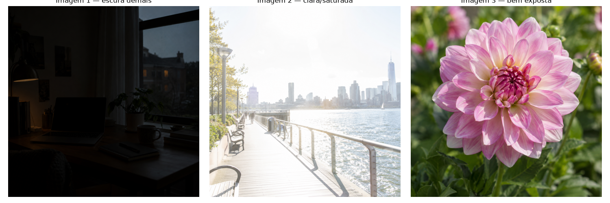
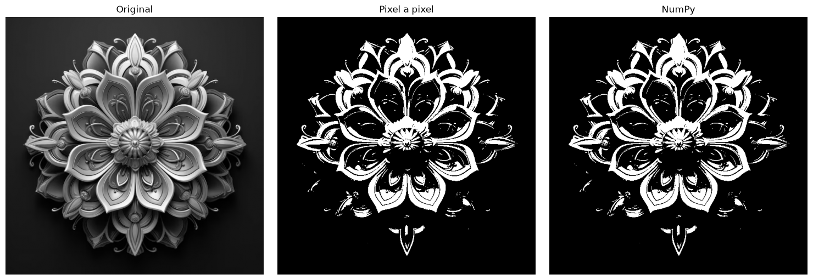
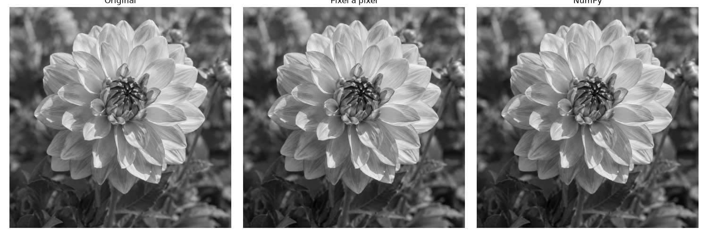
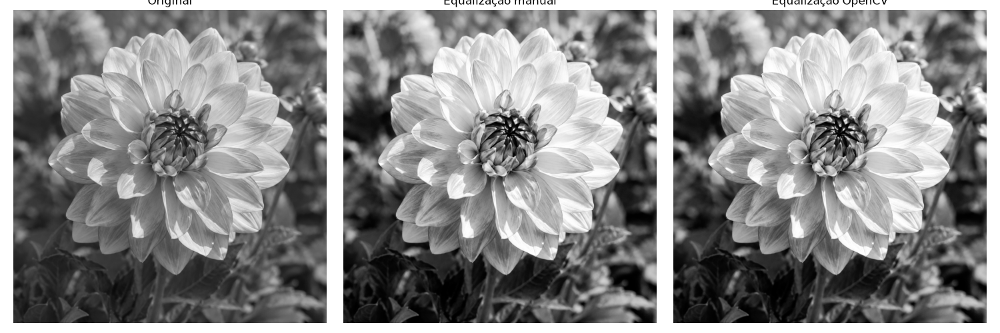
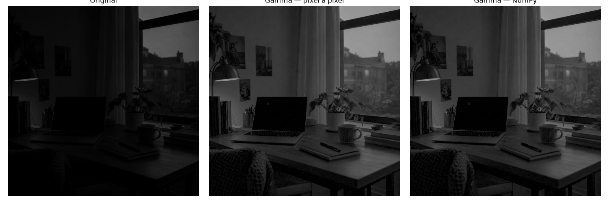
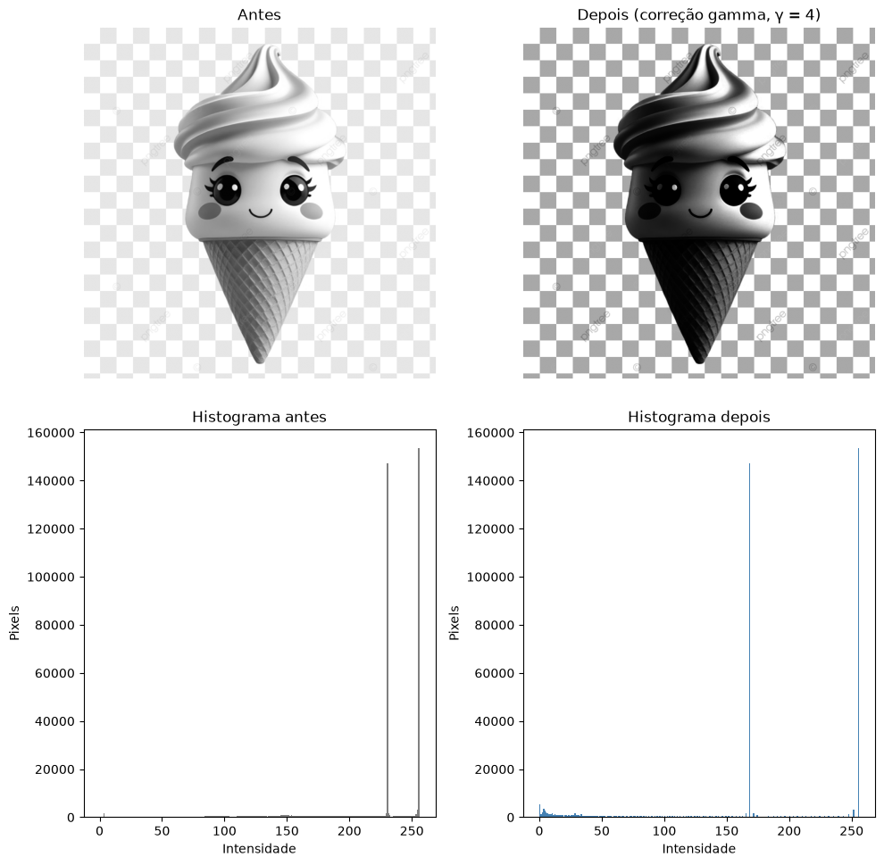
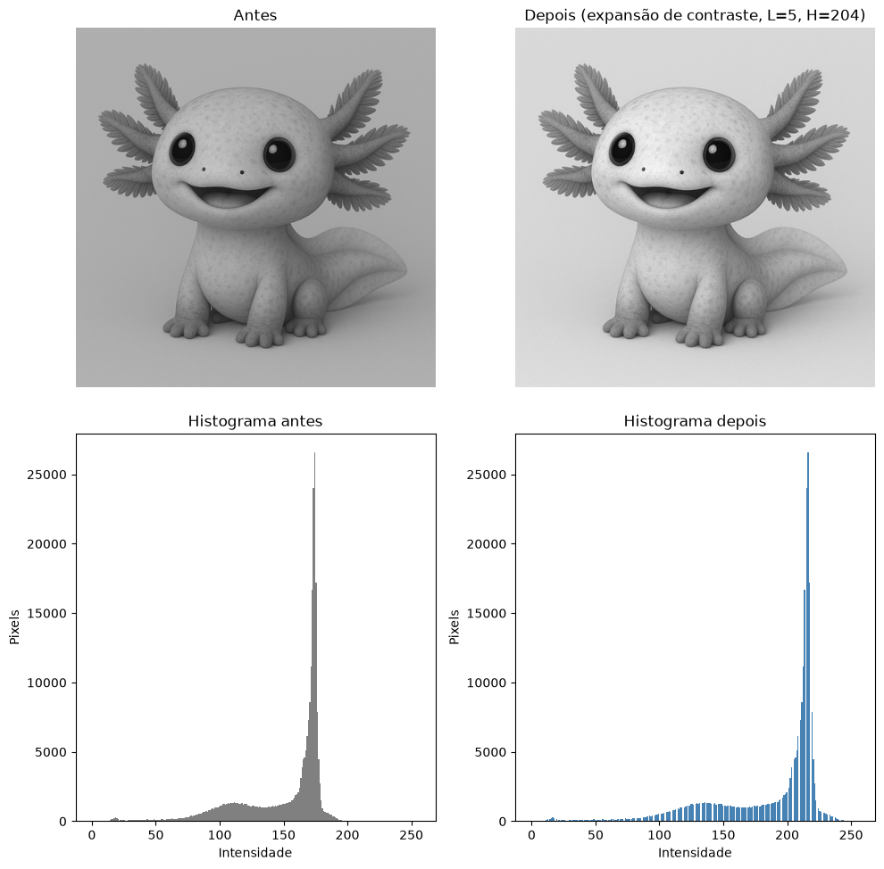

# Atividade 2 — Operações de Processamento de Imagens

[⬅ Voltar para a Atividade 2](../README.md) · [⬅ Voltar para o repositório principal](../../../README.md)

### Sobre esta pasta

Esta pasta guarda uma versão paralela/exploratória da Atividade 2: o notebook
[`operacoes_processamento_imagens.ipynb`](operacoes_processamento_imagens.ipynb), que organiza em
células as funções construídas em aula — **histograma**, **limiarização**, **expansão de
contraste**, **equalização de histograma** e **correção gamma** — e depois usa essas funções para
resolver o exercício de diagnóstico de exposição proposto na entrega:

> Para três imagens com perfis de exposição diferentes (escura demais, clara demais/saturada e bem
> exposta), converter para tons de cinza, plotar o histograma, diagnosticar a distribuição de
> intensidades e escolher/aplicar **uma única operação de correção** por imagem, justificando a
> escolha e o parâmetro usado.

### Como executar

O notebook [`operacoes_processamento_imagens.ipynb`](operacoes_processamento_imagens.ipynb) já
carrega as imagens direto do GitHub (não precisa de upload) e roda do início ao fim no Colab:

1. Abra o notebook no Colab.
2. Rode todas as células em ordem (**Ambiente de execução → Executar tudo**).

As três imagens de entrada (`input_1.png`, `input_2.png`, `input_3.png`) usadas como exemplo estão
em [`../input/`](../input):

<table>
  <tr>
    <td align="left" valign="top">
      
    </td>
  </tr>
</table>

### 1. Funções e testes exploratórios

Antes do exercício principal, cada função da aula é definida e testada isoladamente sobre uma das
imagens, comparando a versão pixel a pixel com a versão vetorizada (NumPy) ou com a função pronta
de biblioteca:

<table>
  <tr>
    <td align="left" valign="top" width="50%">
      
Limiarização (pixel a pixel vs. NumPy):

      
    </td>
    <td align="left" valign="top" width="50%">
      
Expansão de contraste (pixel a pixel vs. NumPy):

      
    </td>
  </tr>
  <tr>
    <td align="left" valign="top" width="50%">
      
Equalização de histograma (manual vs. OpenCV):

      
    </td>
    <td align="left" valign="top" width="50%">
      
Correção gamma (pixel a pixel vs. NumPy):

      
    </td>
  </tr>
</table>

### 2. Diagnóstico e correção por imagem

Para cada uma das três imagens, o notebook plota o histograma, faz um diagnóstico da distribuição
de intensidades e aplica **uma única operação**, escolhida de acordo com o problema específico de
cada imagem — nenhuma das três recebe a mesma correção.

**Imagem 1 — escura demais.** Concentração forte de pixels entre 0 e 60 (~65% do total). Como a
imagem já usa toda a faixa de 0 a 255, a expansão de contraste não teria efeito; a correção
escolhida foi **gamma, γ = 0,5**, que clareia proporcionalmente mais os tons baixos.

**Imagem 2 — clara demais/saturada.** Cerca de 82% dos pixels acima de 200, com dois picos muito
altos perto de 230 e 255. A equalização de histograma foi testada primeiro, mas distorcia a imagem
(a CDF satura logo no início da faixa); a correção escolhida foi **gamma, γ = 4**, que escurece a
saturação sem gerar artefatos.

**Imagem 3 — bem exposta.** Histograma unimodal e compacto entre 100 e 200, sem acúmulos nas
extremidades. Como a imagem não usa toda a faixa (mínimo 5, máximo 204), a correção escolhida foi
**expansão de contraste (L=5, H=204)**.

<table>
  <tr>
    <td align="left" valign="top">
      
<strong>Imagem 2</strong> — antes/depois da correção gamma (γ = 4) com os dois histogramas:

      
    </td>
  </tr>
  <tr>
    <td align="left" valign="top">
      
<strong>Imagem 3</strong> — antes/depois da expansão de contraste (L=5, H=204) com os dois histogramas:

      
    </td>
  </tr>
</table>

### 3. Conclusão

A operação que fez **menos diferença** foi a aplicada na Imagem 3 (bem exposta): a diferença média
de intensidade entre antes e depois foi de apenas 35,7 níveis, contra 50,9 na Imagem 1 e 45,6 na
Imagem 2. Isso acontece porque a Imagem 3 já estava bem exposta — seu intervalo de intensidades já
utilizado (L=5, H=204) cobre boa parte da faixa possível, então a expansão de contraste precisou
"esticar" pouco a imagem. Já as imagens 1 e 2 tinham problemas de exposição mais graves (excesso de
pixels escuros ou muito claros concentrados em faixas estreitas), então as correções aplicadas
produziram mudanças bem mais visíveis.
