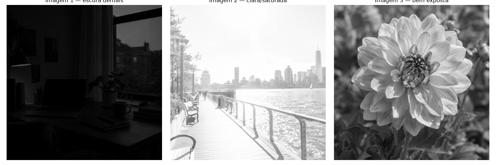
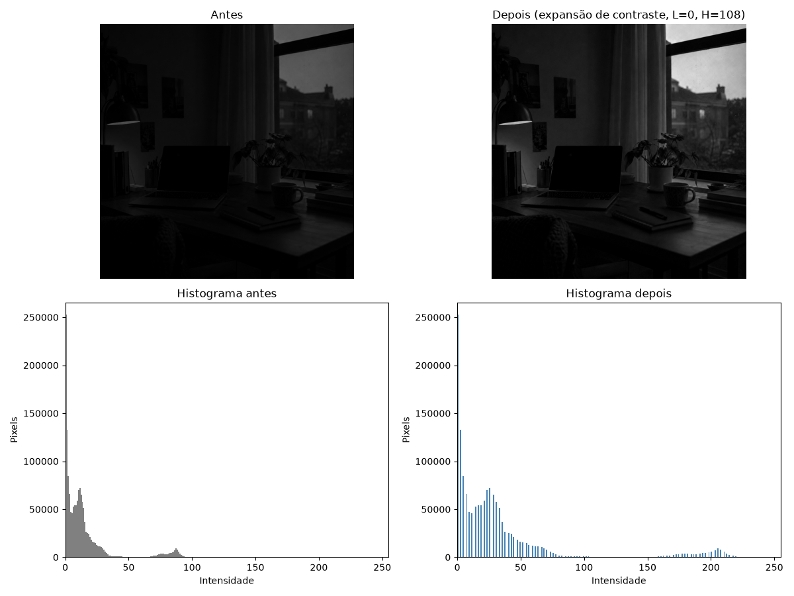

# Atividade 2 — Operações de Processamento de Imagens

[⬅ Voltar para a Atividade 2](../README.md)

> Esta pasta guarda uma versão paralela/exploratória da Atividade 2: o notebook, que organiza em
células as funções construídas em aula — **histograma**, **limiarização**, **expansão de
contraste**, **equalização de histograma** e **correção gamma** — e depois usa essas funções para
resolver o exercício de diagnóstico de exposição proposto na entrega:

### Como executar

O notebook [`operacoes_processamento_imagens.ipynb`](operacoes_processamento_imagens.ipynb) já
carrega as imagens direto do GitHub (não precisa de upload) e roda do início ao fim no Colab:

1. Abra o notebook no Colab.
2. Rode todas as células em ordem (**Ambiente de execução → Executar tudo**).

As três imagens de entrada (`input_1.png`, `input_2.png`, `input_3.png`) usadas como exemplo estão
em [`../input/`](../input):

<table>
  <tr>
    <td align="left" valign="top">
      
    </td>
  </tr>
</table>

---

### 1. Funções e testes exploratórios

Antes do exercício principal, cada função da é definida e testada isoladamente sobre uma das
imagens, comparando a versão pixel a pixel com a versão vetorizada (NumPy) ou com a função pronta
de biblioteca:

<table>
  <tr>
    <td align="left" valign="top" width="50%">
      
Limiarização (pixel a pixel vs. NumPy):

      
    </td>
 </tr>
  <tr>
    <td align="left" valign="top" width="50%">
      
Expansão de contraste (pixel a pixel vs. NumPy):

      
    </td>
  </tr>
  <tr>
    <td align="left" valign="top" width="50%">
      
Equalização de histograma (manual vs. OpenCV):

      
    </td>
  </tr>
  <tr>
    <td align="left" valign="top" width="50%">
      
Correção gamma (pixel a pixel vs. NumPy):

      
    </td>
  </tr>
</table>

---

### 2. Diagnóstico e correção por imagem

Para cada uma das três imagens, o notebook plota o histograma, faz um diagnóstico da distribuição
de intensidades e aplica **uma única operação**, escolhida de acordo com o problema específico de
cada imagem — nenhuma das três recebe a mesma correção.

**Imagem 1 — escura demais.** Concentração forte de pixels entre 0 e 60 (93,5% do total), com média
13,7 e valor máximo de apenas 108 — a imagem não usa boa parte da faixa de 0 a 255. Como há espaço
real para esticar o intervalo, a correção escolhida foi **expansão de contraste (L=0, H=108)**, que
usa todo o intervalo realmente ocupado pela imagem.

**Imagem 2 — clara demais/saturada.** Cerca de 81,5% dos pixels acima de 200, com média 229,3 e
valor máximo já em 255 — como a imagem já satura no branco, a expansão de contraste não reduziria
esse estouro (o teto já está em 255); a correção escolhida foi **gamma, γ = 4**, que escurece a
saturação sem gerar artefatos.

**Imagem 3 — tons médios.** Histograma amplo entre 7 e 255 (média 113,3, desvio 53,9), sem grandes
acúmulos nas extremidades — a imagem já ocupa quase toda a faixa de intensidades, então esticar o
contraste teria pouco efeito. A correção escolhida foi a **equalização de histograma**, que
redistribui as intensidades para melhorar o contraste local.

<table>
    <tr>
    <td align="left" valign="top">
      
<strong>Imagem 1</strong> — antes/depois da expansão de contraste (L=0, H=108) com os dois histogramas:

      
    </td>
  </tr>
  <tr>
    <td align="left" valign="top">
      
<strong>Imagem 2</strong> — antes/depois da correção gamma (γ = 4) com os dois histogramas:

      
    </td>
  </tr>
  <tr>
    <td align="left" valign="top">
      
<strong>Imagem 3</strong> — antes/depois da equalização de histograma com os dois histogramas:

      
    </td>
  </tr>
</table>

---

### 3. Conclusão

A operação que fez **menos diferença** foi a aplicada na Imagem 1 (mesa à noite): a diferença média
de intensidade entre antes e depois foi de apenas 18,2 níveis, contra 22,9 na Imagem 3 e 45,1 na
Imagem 2. Isso acontece porque, embora a Imagem 1 seja muito escura, a maior parte dos seus pixels
está concentrada bem perto de zero (média 13,7); mesmo esticando o intervalo real da imagem
(L=0, H=108) para toda a faixa de 0 a 255, o deslocamento absoluto médio de cada pixel continua
pequeno. Já a Imagem 2 tinha um problema de exposição mais grave (saturação forte perto do branco),
então a correção gamma aplicada produziu uma mudança bem mais visível.
