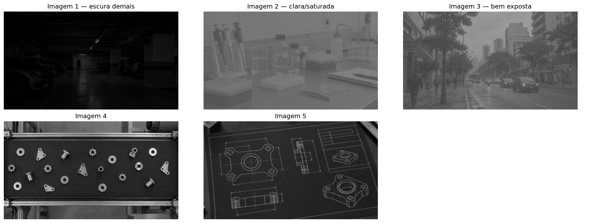
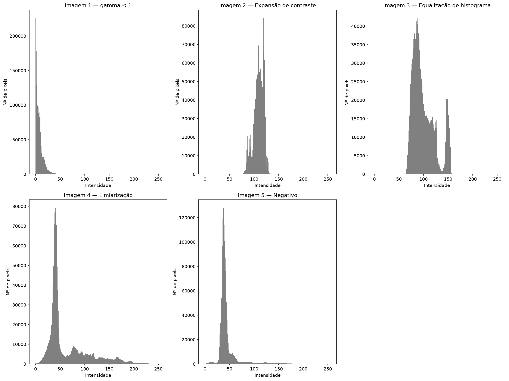
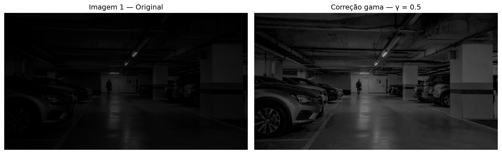
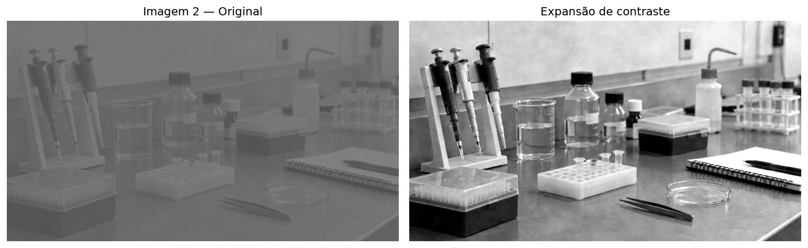
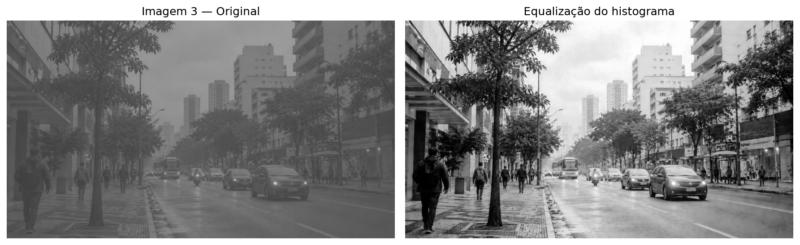
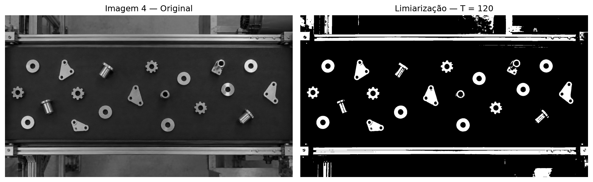
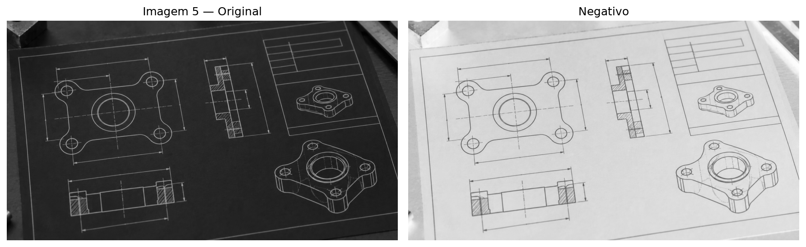
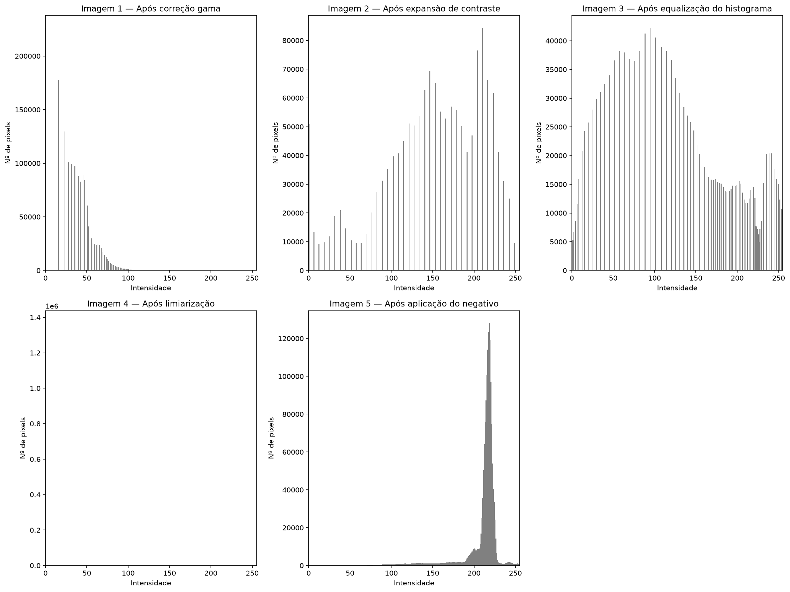
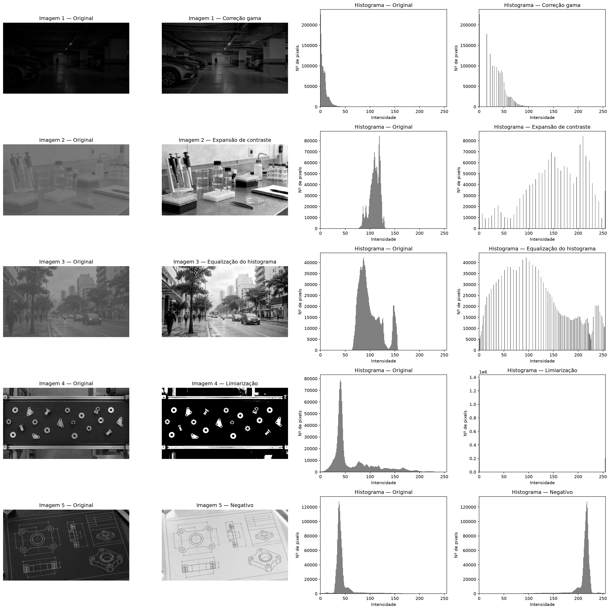

# Atividade 3 — Realce e Segmentação em Múltiplas Imagens


[](https://colab.research.google.com/github/lianeheidemann/atividades-processamento-de-imagens/blob/main/atividade/atividade-3/atividade-3.ipynb)

[⬅ Voltar para o repositório principal](../../README.md)

> Selecionar cinco imagens com problemas de exposição ou contraste diferentes, converter cada uma para tons de cinza e aplicar, para cada uma delas, a técnica de tratamento mais adequada ao seu problema específico: correção gama, expansão de contraste, equalização de histograma, limiarização e negativo.

## 1. Imagens de input

Cinco imagens com características distintas são usadas para explorar uma técnica de tratamento diferente em cada uma:

- **Imagem 1** — escura demais.
- **Imagem 2** — clara/saturada.
- **Imagem 3** — bem exposta, porém com baixo contraste global.
- **Imagem 4** — peças metálicas claras sobre uma esteira escura.
- **Imagem 5** — desenho de linhas claras sobre fundo escuro.

<table>
  <tr>
    <td align="left" valign="top">
      
    </td>
  </tr>
</table>

```python
imagem_cinza_1 = np.array(imagem_1.convert("L"), dtype=np.uint8)
```

## 2. Histogramas

O histograma de cada imagem original é calculado para identificar o problema de exposição/contraste de cada uma antes de escolher a técnica de tratamento:

<table>
  <tr>
    <td align="left" valign="top">
      
    </td>
  </tr>
</table>

## 3. Tratamento de imagens

#### Imagem 1 — Correção gama

A imagem está subexposta. A correção gama clareia principalmente os tons escuros, revelando detalhes sem alterar tudo de forma linear. Foi usado γ = 0,5, já que gama < 1 clareia a imagem:

```python
gamma = 0.5
imagem_normalizada = imagem_cinza_1.astype(np.float32) / 255.0
imagem_1_tratada = np.power(imagem_normalizada, gamma)
imagem_1_tratada = np.clip(imagem_1_tratada * 255, 0, 255).astype(np.uint8)
```



#### Imagem 2 — Expansão de contraste

Os níveis de cinza estão concentrados em uma faixa estreita e clara, deixando a imagem "lavada". A expansão redistribui essa faixa para aumentar a separação entre objetos e fundo, usando os percentis 2 e 98 como limites para ignorar pixels extremos:

```python
limite_inferior = np.percentile(imagem_cinza_2, 2)
limite_superior = np.percentile(imagem_cinza_2, 98)

resultado_contraste = (imagem_cinza_2.astype(np.float32) - limite_inferior) * (
    255.0 / (limite_superior - limite_inferior)
)
resultado_contraste = np.clip(resultado_contraste, 0, 255).astype(np.uint8)
```



#### Imagem 3 — Equalização do histograma

A cena apresenta contraste global baixo, com muitos tons médios semelhantes. A equalização distribui melhor as intensidades a partir da distribuição acumulada (CDF) do histograma, evidenciando melhor os detalhes da cena:

```python
histograma = np.bincount(imagem_cinza_3.ravel(), minlength=256)
distribuicao_acumulada = histograma.cumsum()

tabela_equalizacao = (
    (distribuicao_acumulada - cdf_minimo) / (total_pixels - cdf_minimo)
) * 255
resultado_equalizacao = tabela_equalizacao[imagem_cinza_3]
```



#### Imagem 4 — Limiarização

Existe uma separação clara entre as peças metálicas claras e a esteira escura. A limiarização transforma a imagem em binária (T = 120), sendo útil para segmentar, contar e localizar as peças:

```python
limiar = 120
resultado_limiarizacao = np.where(imagem_cinza_4 >= limiar, 255, 0).astype(np.uint8)
```



#### Imagem 5 — Negativo

Como o desenho possui linhas claras sobre fundo escuro, o negativo produz linhas escuras sobre fundo claro, facilitando a leitura, impressão e análise das linhas:

```python
resultado_negativo = 255 - imagem_cinza_5
```



## 4. Histograma das imagens tratadas

Após aplicar a técnica adequada a cada imagem, os novos histogramas mostram o efeito de cada tratamento na distribuição de intensidades:

<table>
  <tr>
    <td align="left" valign="top">
      
    </td>
  </tr>
</table>

## 5. Comparação antes/depois

Visão consolidada com a imagem original, a imagem tratada e os histogramas de ambas, lado a lado, para cada uma das cinco imagens:

<table>
  <tr>
    <td align="left" valign="top">
      
    </td>
  </tr>
</table>

## 6. Resumo das técnicas aplicadas

| Imagem | Problema identificado | Técnica aplicada |
| :----: | :--------------------- | :---------------- |
| 1 | Subexposta (escura) | Correção gama (γ = 0,5) |
| 2 | Clara/saturada, baixo contraste | Expansão de contraste |
| 3 | Bem exposta, mas baixo contraste global | Equalização de histograma |
| 4 | Objetos claros sobre fundo escuro | Limiarização (T = 120) |
| 5 | Linhas claras sobre fundo escuro | Negativo |
